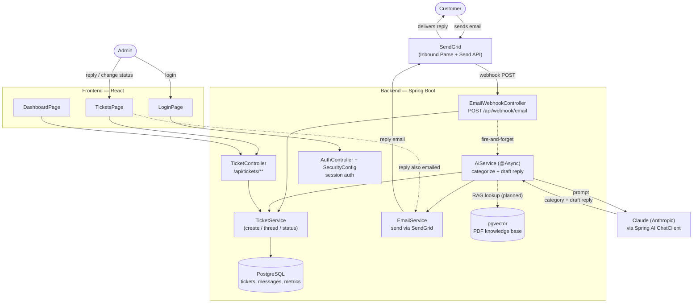
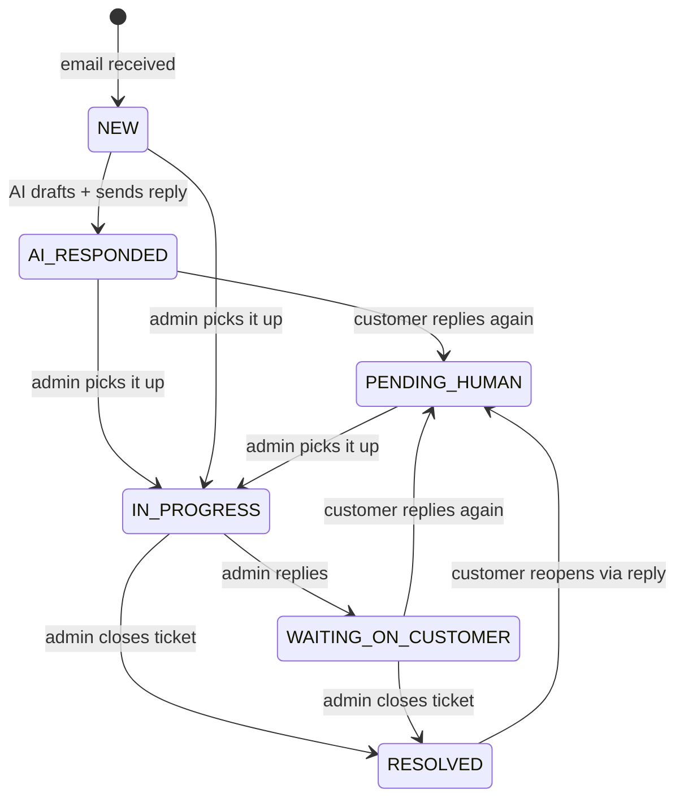

# Customer Support Management System

An AI-powered, single-admin customer support platform. Customer emails arrive via webhook, get auto-categorized and auto-answered by Claude (Anthropic) using a PDF knowledge base, and get escalated to a human admin whenever the AI can't fully resolve them. The admin reviews, replies, and tracks everything through a React dashboard.

> See [PROJECT_PLAN.md](PROJECT_PLAN.md) for full feature scope and [TECH_STACK.md](TECH_STACK.md) for stack rationale.

---

## How it works

1. A customer emails your support address.
2. SendGrid's **Inbound Parse** forwards that email as a webhook POST to the backend.
3. The backend creates a **ticket**, then asynchronously asks **Claude** to categorize it (Billing / Technical / General Inquiry / Other) and draft a reply.
4. The AI reply is emailed back to the customer via SendGrid, with a `[Ticket #N]` marker in the subject so any follow-up reply threads back onto the same ticket instead of creating a new one.
5. If the customer replies again, or the AI can't confidently resolve the issue, the ticket is flagged **Pending Human** and shows up for the admin in the dashboard.
6. The admin reviews the full thread, replies directly, updates status, and tracks everything (volume, response times, AI-vs-human ratio) on the metrics dashboard.

---

## Architecture



---

## Ticket status lifecycle



---

## Tech Stack

**Backend** — Spring Boot 3.5.3, Java 21, Spring Security (session auth), Spring Data JPA, PostgreSQL, Spring AI (Claude via `spring-ai-starter-model-anthropic`), pgvector (knowledge base, in progress), SendGrid (inbound parse + outbound send).

**Frontend** — React 19, Vite, Tailwind CSS v4, React Router v7, Recharts.

See [TECH_STACK.md](TECH_STACK.md) for details.

---

## Project structure

```
backend/
  src/main/java/com/customersupport/
    controller/        REST controllers (tickets, auth, health, email webhook)
    service/            TicketService, AiService, EmailService, MetricsService
    model/               Ticket, TicketMessage, TicketStatus, TicketCategory, ...
    repository/         Spring Data JPA repositories
    dto/                Request/response DTOs
    SecurityConfig.java  auth + public route rules
    CorsConfig.java      CORS for the frontend origin

frontend/
  src/
    pages/              LoginPage, TicketsPage, DashboardPage
    components/         Navbar, ProtectedRoute
    context/            AuthContext (session state)
    services/           API client (ticketService.js)
```

---

## Running locally

### Backend

```bash
cd backend
./mvnw spring-boot:run
```

Configure `src/main/resources/application.properties` before running:

| Key | Purpose |
|---|---|
| `spring.datasource.*` | PostgreSQL connection |
| `spring.ai.anthropic.api-key` | Claude API key |
| `app.sendgrid.api-key` | SendGrid API key for outbound replies |
| `app.email.from-address` / `app.email.from-name` | Verified SendGrid sender |
| `app.webhook.secret` | Optional shared secret for `X-Webhook-Secret` header on the inbound webhook |
| `app.admin.email` / `app.admin.password` | Single admin login |
| `app.cors.allowed-origins` | Frontend origin (must match the Vite dev port) |

For SendGrid Inbound Parse, point the "Destination URL" at `https://<your-domain>/api/webhook/email` (a tunnel like ngrok works for local dev).

### Frontend

```bash
cd frontend
npm install
npm run dev
```

Runs on a fixed port (`5174`) — must match `app.cors.allowed-origins` on the backend.

---

## Testing

**Backend:** `./mvnw test` — unit (Mockito), integration (MockMvc), and E2E (real HTTP) auth tests.
**Frontend:** `npm test` — Vitest + React Testing Library, all network calls mocked.

See [CLAUDE.md](CLAUDE.md) for the full test file breakdown and commands.

---

## Status / roadmap

- ✅ Auth, ticket CRUD + threading, dashboard metrics, email ingestion (SendGrid), AI categorization + auto-reply (Claude)
- 🚧 PDF knowledge base ingestion + pgvector-backed RAG (embedding model not yet wired — Claude doesn't provide embeddings, so an additional provider is needed)
- 📋 See [PROJECT_PLAN.md](PROJECT_PLAN.md) for the full MVP scope and explicit out-of-scope items
